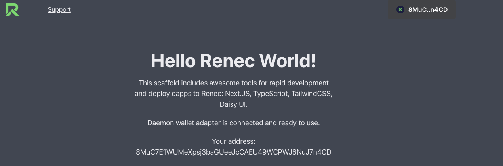
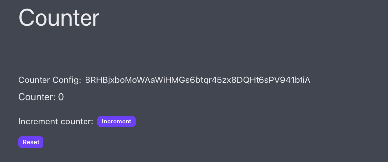

# dapp-starter

This repo provides a starting point for building a dapp on the `renec` blockchain.

## Prerequisite

- cargo / rust

## Program Scripts

### Setup environemnts

- To setup program dependencies, run:

```bash
make install-deps
```

This will install the `anchor` and `solana` cli if needed. Default `solana 1.14.6`, `anchor 0.25.0`

To use different version compatible with `renec cluster`, set the `CLUSTER` and `ANCHOR_VERSION` environment variables and run the command
</br>
For example:

```bash
CLUSTER=mainnet ANCHOR_VERSION=0.20.1 make install-deps
```

`CLUSTER` can either be `mainnet`, `testnet` or `localnet`. By setting the cluster correctly, the installer will set the corresponding `cli` for program's interaction.

- To run a `localnet` that has the same version as `renec-mainnet`, run;

```
make localnet
```

- To run a `localnet` that has the same version as `renec-testnet`, run;

```bash
CLUSTER=testnet make localnet
```

`CLUSTER` variables can be either `mainnet`, `testnet` or `localnet`, which corresponding to `RENEC cluster url`. Default `CLUSTER` is `testnet`.

### Setup wallets

- To gen a new wallet, run:

```bash
make gen-wallet name="<wallet-name>"
```

If not passing `name` parameter, the default name of the wallet will be `id`. The wallets' screte keys will be stored in `./wallets` folder.

- To import an existing wallet, run:

```bash
make import-wallet name="<wallet-name>"
```

- To request faucet token in `testnet` or `localnet`, run:

```bash
make faucet amount=1  name="<wallet-name>"
```

### Build && Deploy

- To build program:

```bash
make build
```

This command will generate the `program keypair` if needed, and replace it inside `programs/dapp-starter/src/lib.rs` file.
Then it will build the program and generate `program so` file.

</br>
For FE interaction, this script copies the `dapp_starter.json`, `dapp_starter.ts` and replace `program_id` into the `config.json` file in `app/src/artifacts` folder.

- To deploy

```bash
CLUSTER=mainnet make deploy name="<wallet-name>"
```

This command deploy the program, under `.wallets/<wallet-name>.json` authority. The program will be deploy to `CLUSTER` env, which could either be `localnet`, `mainnet` or `testnet`

## Frontend

- The frontend is built with `next-js` and `typescript`. It uses `@project-serum/anchor` to interact with the program.
  </br>

- The FE uses [daemon-wallet](https://renec.foundation/en/support/how-to-create-a-new-demon-wallet) to connect with `renec-blockchain`.
  

- The provided program and the FE provide a simple `counter` program, which allows users to `initialize a counter`, and `increment` the count in that `counter`.
  

### Presequisites

- [Node.js 16.8.0](https://nodejs.org/en) or newer
- `build and deploy` the program to the `renec testnet`. Make sure that you've run `make build` and `CLUSTER=testnet make deploy` before running the frontend.

### Build and run

```bash
cd app
```

```bash
yarn && yarn dev
```
